# Finite Element Topology Optimization
---

## 2D Demos
<table>
    <tr>
        <td>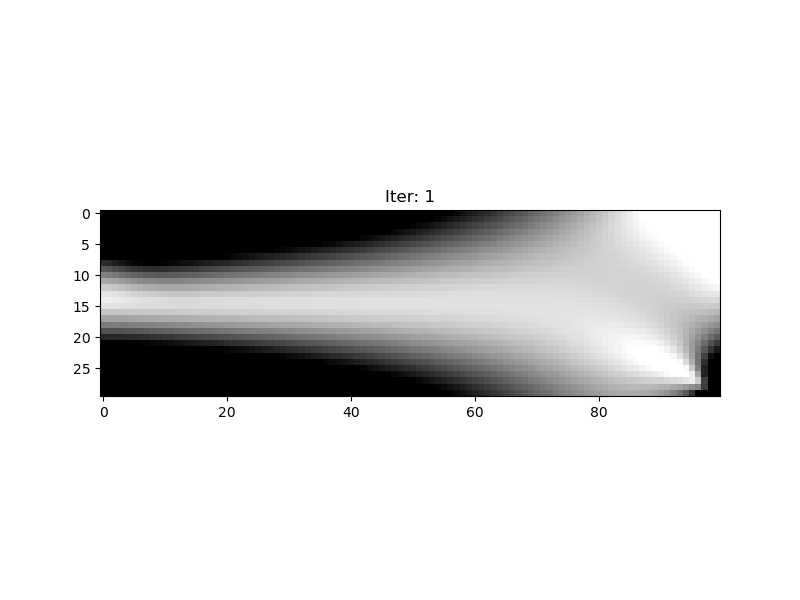</td>
        <td>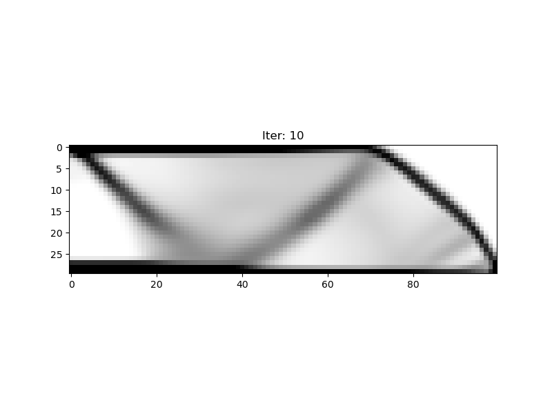</td>
        <td>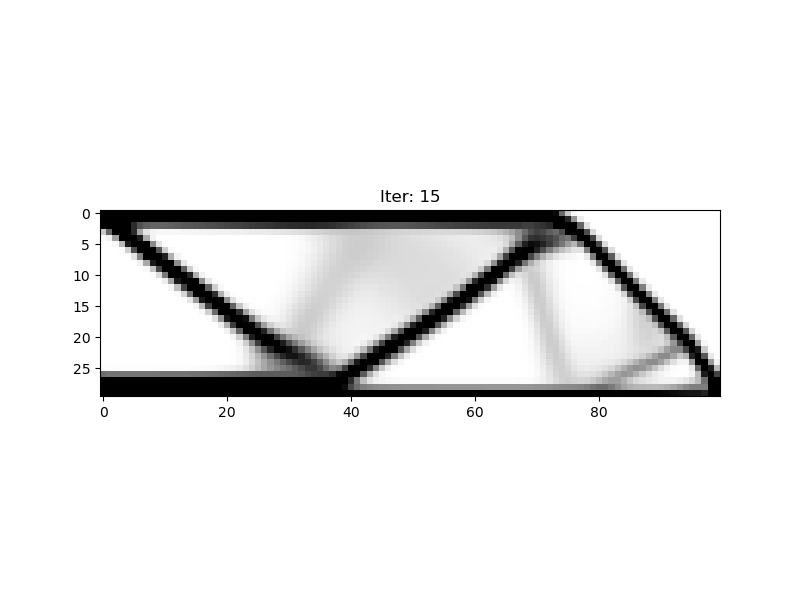</td>
        <td>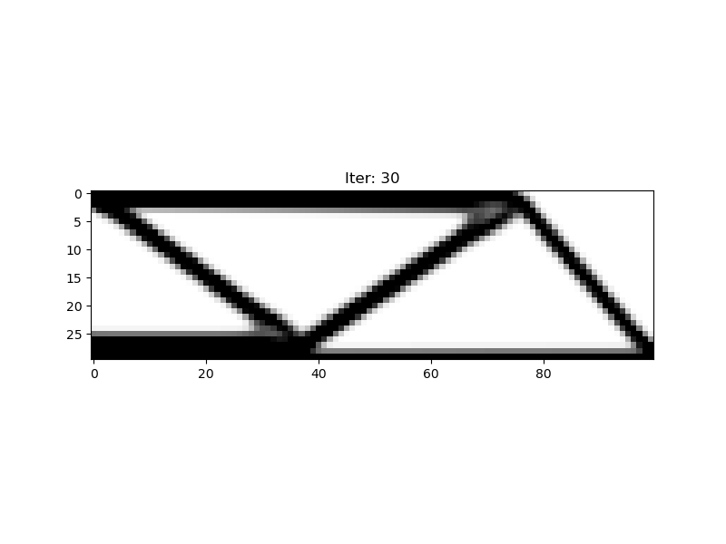</td>
    </tr>
    <tr>
        <td>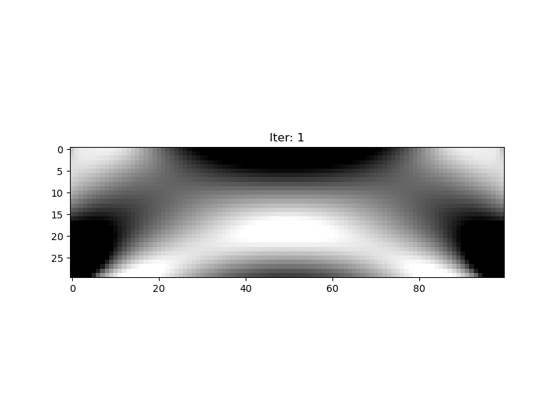</td>
        <td>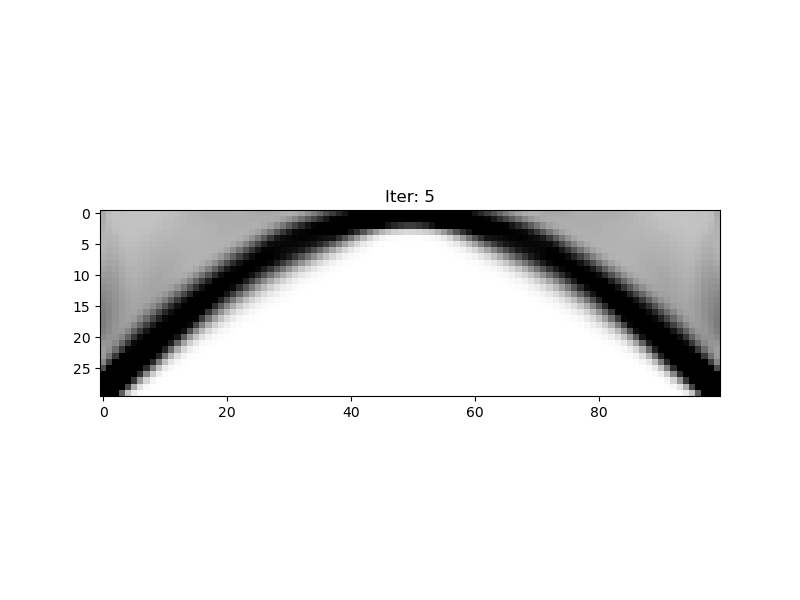</td>
        <td>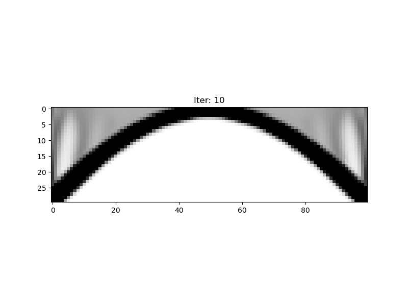</td>
        <td>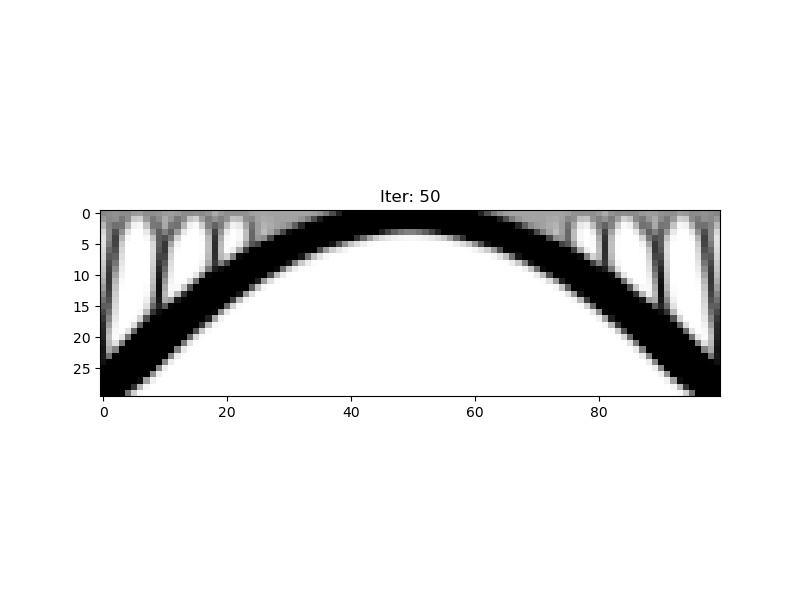</td>
    </tr>
</table>

## 3D Demos
<table>
    <tr>
        <td>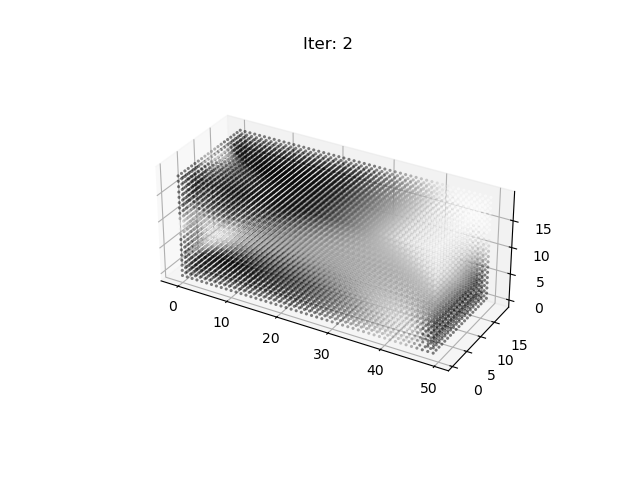</td>
        <td>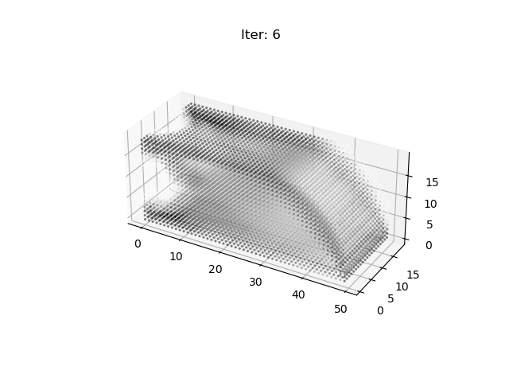</td>
        <td>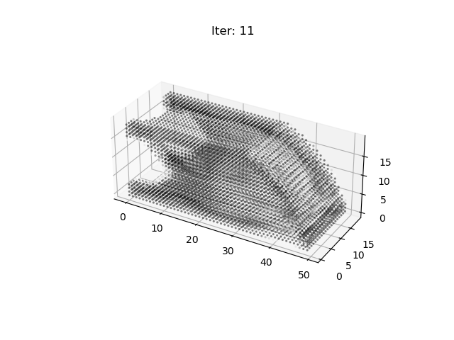</td>
        <td>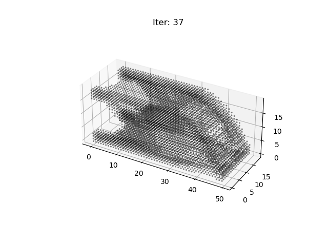</td>
    </tr>
    <tr>
        <td>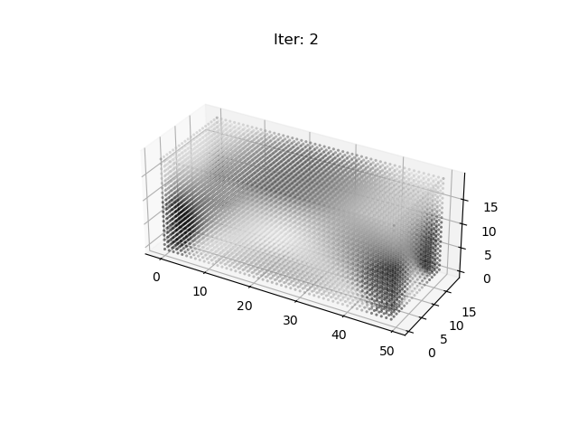</td>
        <td>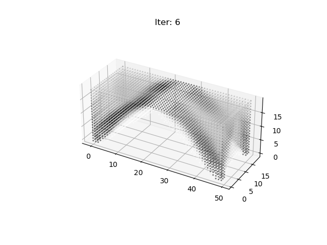</td>
        <td>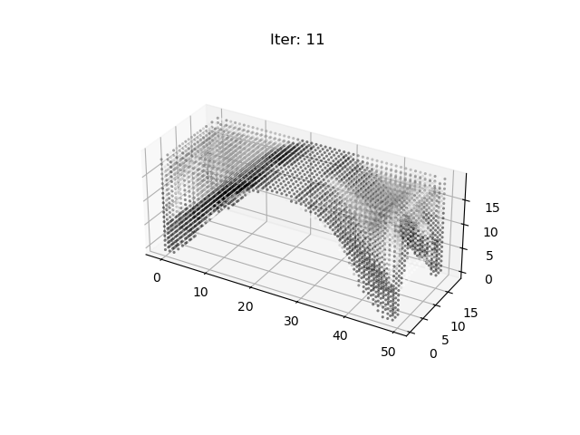</td>
        <td>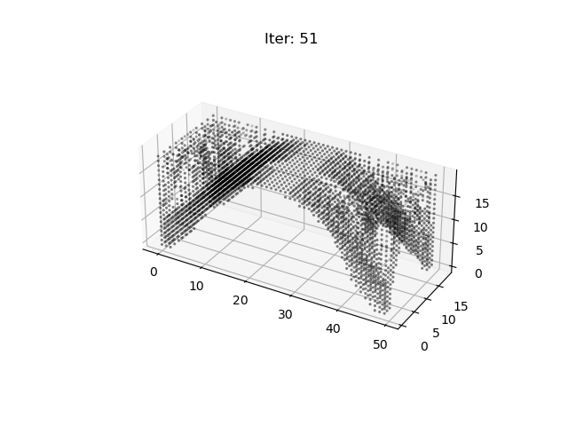</td>
    </tr>
    <tr>
        <td></td>
        <td>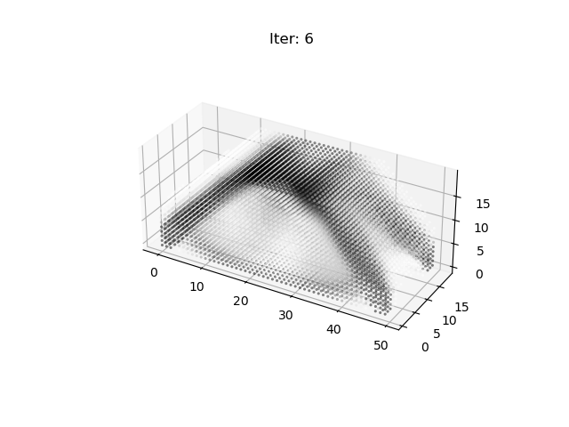</td>
        <td>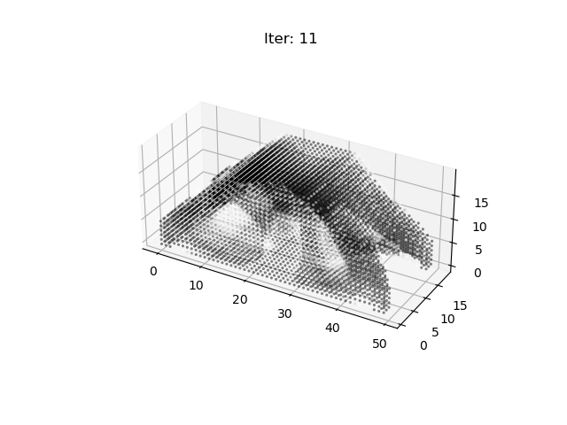</td>
        <td></td>
    </tr>
</table>